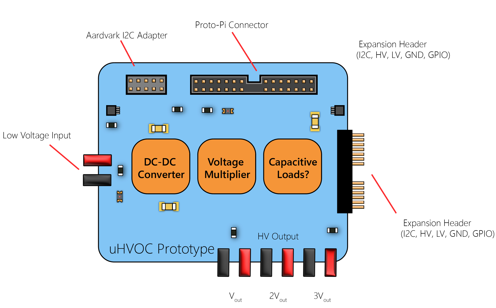

Univeral High Voltage Optimized Converter (uHVOC)
=================================================

===========
Description
===========

uHVOC is a multi-output high voltage DC-DC converter designed for use as an evaluation platform
or in any scenario that needs multiple high voltages. The board can be used without any external
controllers thanks to an integrated HV9150 DC-DC controller, but optionally can be controlled with 
a microcontroller or Raspberry Pi through the integrated `Proto Pi`_ connector.

.. _Proto Pi: https://github.com/Animal-Inspired-Motion-And-Robotics-Lab/Proto-Pi-Board

=========
Features
=========

#. Generates three high voltages at Vout, 2Vout and 4Vout.
#. Voltage, duty cycle, switching frequency programmable via potentiometer or Proto-Pi.  

=========
Examples
=========

===========
Configuring
===========

=========
Features
=========

====
Todos
====

#. Figure out capacitive load designed and determine if I want it.
#. Determine if I want to add 2x electroadhesion H-bridges.
#. Figure out how to include microcontroller connection.
#. Design voltage multiplier module.

=======
License
=======

Attribution-ShareAlike 4.0 International